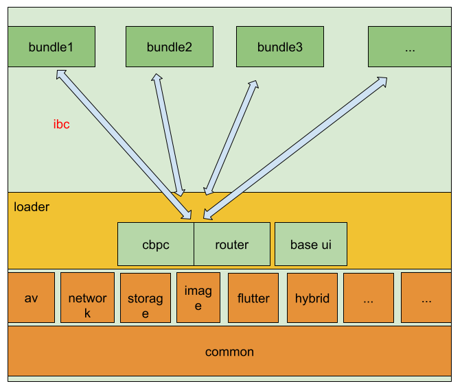

# Healthy Condition

| branches  | Build Status   |
|---| --- |
| Spacecraft-Plan/SpacecraftAndroid master branch  | [](https://travis-ci.com/Spacecraft-Plan/SpacecraftAndroid)   |
|  JamesfChen/SpacecraftAndroid master branch |  [](https://travis-ci.org/JamesfChen/Spacecraft)  |
|  gitlab/SpacecraftAndroid master branch |  [](https://gitlab.com/spacecraft-plan/spacecraftandroid/-/commits/master) |
| feature/kotlin-gradle branch   |  [](https://travis-ci.org/JamesfChen/Spacecraft) |
|  apk  |  [download url](https://www.pgyer.com/rDcO) |

```
hotel-module
--- android 组件化项目
--- groovy-gradle-plugin android项目的gradle plugin for groovy
--- kotlin-gradle-plugin android项目的gradle plugin for kotlin
--- apm server #apm服务
```

# To be Architect
> 驽马十驾功在不舍



|  language  |  files |lines|
|---| --- |---|
|  java|201 |24923|
|  kotlin|256|14222|
|  c or c++|46|9095|

## Foundation
### Common
- [x] utils
- [ ] mvp、mvvm：20%
- [x] asynchronize:kotlin corountine、RxJava、AsyncTask
- [ ] serialization:persistence(json/protobuf)、memory(Parcelable/Serializable interface)

### Network
~- [x] 提供mock环境、real环境、real local server环境~
- [x] network service : Retrofit+RxJava2
- [x] mock:stetho + mockserver

### Storage
- [ ] Room/Realm,SharedPreference

### Image & Graphic

### Audio & Video
- [x] screen recorder

### LBS(Location & Map)
- [x] collection location 、 wifi 、 cell info

### 1.UI Component
- [x] provide ui component , es.video component

## Business Bundle
- [ ] native bundle
    - [x] account-module
    - [ ] im-module
- [ ] hybrid bundle
- [ ] ReactNative/Flutter bundle

## Improve Development Efficiency

为了提高项目的编译速度，我将该项目组件化，组件化的模板代码可以看[bundles-assembler](https://github.com/JamesfChen/bundles-assembler)这个项目。

- [x] gradle plugin：
1. file lines counter plugin(./gradlew app:counter)
3. upload bugly mapping or so file plugin( ./gradlew reportMappingDebug  &&  ./gradlew reportSoDebug)
4. performance plugin: trace method(instrumentation)
- [x] CI / CD
- [x] hook:jni hook、java hook


